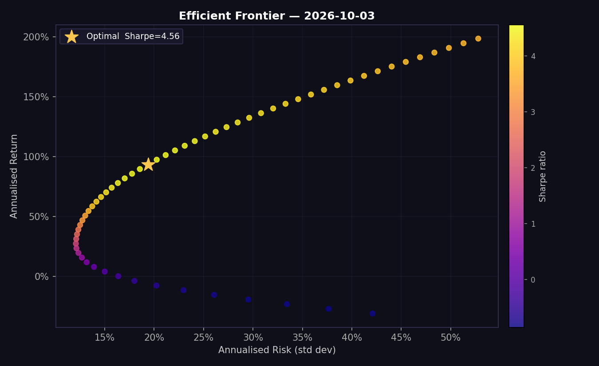
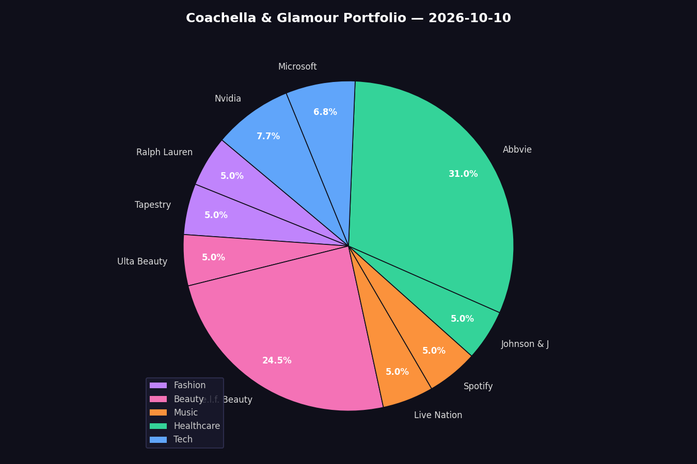
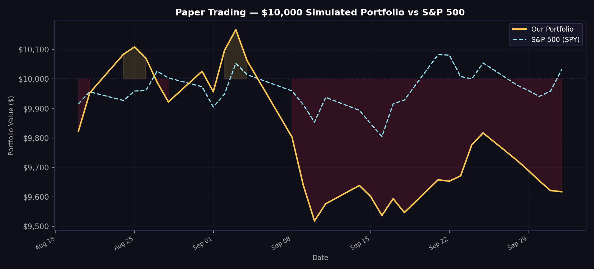
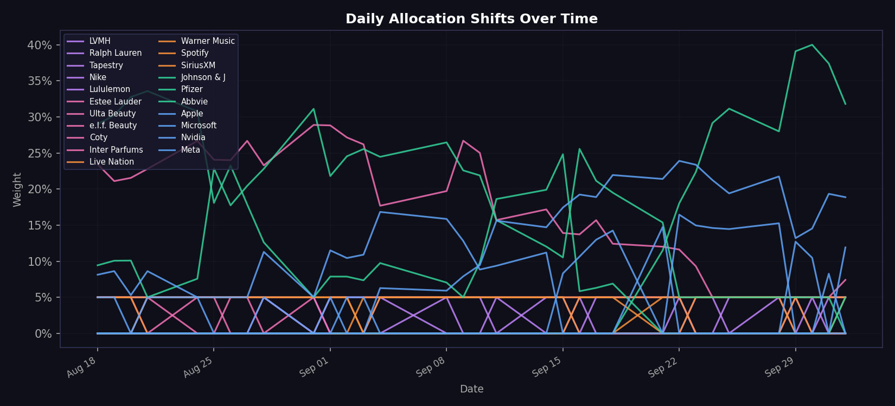

# 🎶 Coachella & Glamour Portfolio — 2026-09-29

> **Strategy:** MPT with binary linking constraints, 60-day sliding window
> **Mode:** 🚀 MAX SHARPE
> **Stocks selected:** 10 / 25 &nbsp;|&nbsp; **Sectors:** 5

---

## 📊 Optimal Allocation (Linking Constraints: 5% ≤ X ≤ 40%)

| Stock | Ticker | Sector | Weight | Binary Y |
|-------|--------|--------|--------|----------|
| Abbvie | `ABBV` | Healthcare | **34.95%** | ✅ 1 |
| e.l.f. Beauty | `ELF` | Beauty | **21.59%** | ✅ 1 |
| Nvidia | `NVDA` | Tech | **7.00%** | ✅ 1 |
| Microsoft | `MSFT` | Tech | **6.46%** | ✅ 1 |
| LVMH | `LVMUY` | Fashion | **5.00%** | ✅ 1 |
| Ralph Lauren | `RL` | Fashion | **5.00%** | ✅ 1 |
| Ulta Beauty | `ULTA` | Beauty | **5.00%** | ✅ 1 |
| Live Nation | `LYV` | Music | **5.00%** | ✅ 1 |
| Spotify | `SPOT` | Music | **5.00%** | ✅ 1 |
| Johnson & J | `JNJ` | Healthcare | **5.00%** | ✅ 1 |

**Stocks excluded (Y=0, X=0):**
`TPR`, `NKE`, `LULU`, `EL`, `COTY`, `IPAR`, `WMG`, `IHRT`, `SIRI`, `UNH`, `LLY`, `PFE`, `AAPL`, `META`, `GOOGL`

---

## 📈 Portfolio Performance

| Metric | Our Portfolio | S&P 500 (SPY) |
|--------|--------------|---------------|
| Annualised Return | **77.50%** | 11.86% |
| Annualised Risk   | 18.12% | 12.72% |
| Sharpe Ratio      | **4.000** | 0.539 |
| Max Drawdown      | — | -4.49% |

---

## 💰 Paper Trading (Simulated $10,000)

| Portfolio Value | SPY Value |
|----------------|-----------|
| **$9,938.90** | $9,935.55 |

Return vs Buy-and-Hold SPY: **-0.61%** vs -0.64%

---

## 🌡️ Fear Index & Market Signals

**VIX Level:** 16.1 ✅ Normal — max-Sharpe mode active

**Golden Cross Signals (10d MA vs 30d MA):**

| Ticker | Signal |
|--------|--------|
| `LVMUY` | 🔴 Bearish |
| `RL` | ⚪ Neutral |
| `TPR` | 🔴 Bearish |
| `NKE` | 🔴 Bearish |
| `LULU` | 🔴 Bearish |
| `EL` | ⚪ Neutral |
| `ULTA` | 🟢 Bullish |
| `ELF` | ⚪ Neutral |
| `COTY` | 🔴 Bearish |
| `IPAR` | 🟢 Bullish |
| `LYV` | 🔴 Bearish |
| `WMG` | ⚪ Neutral |
| `SPOT` | ⚪ Neutral |
| `IHRT` | 🔴 Bearish |
| `SIRI` | 🔴 Bearish |
| `UNH` | ⚪ Neutral |
| `JNJ` | 🟢 Bullish |
| `LLY` | ⚪ Neutral |
| `PFE` | ⚪ Neutral |
| `ABBV` | 🟢 Bullish |
| `AAPL` | 🟢 Bullish |
| `MSFT` | 🟢 Bullish |
| `NVDA` | 🟢 Bullish |
| `META` | 🟢 Bullish |
| `GOOGL` | 🟢 Bullish |

---

## 📉 Charts

---
*Auto-generated by GitHub Actions · 2026-09-29 · OPIM 5641*