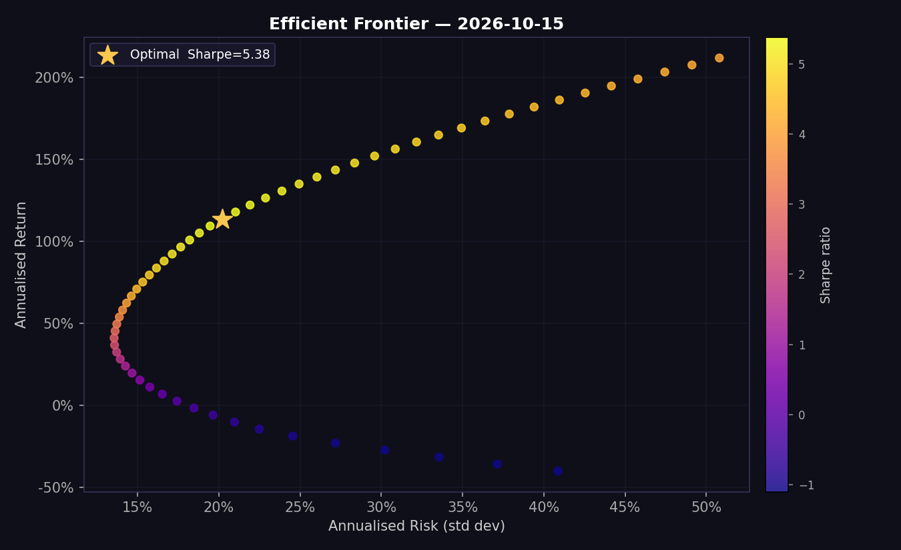
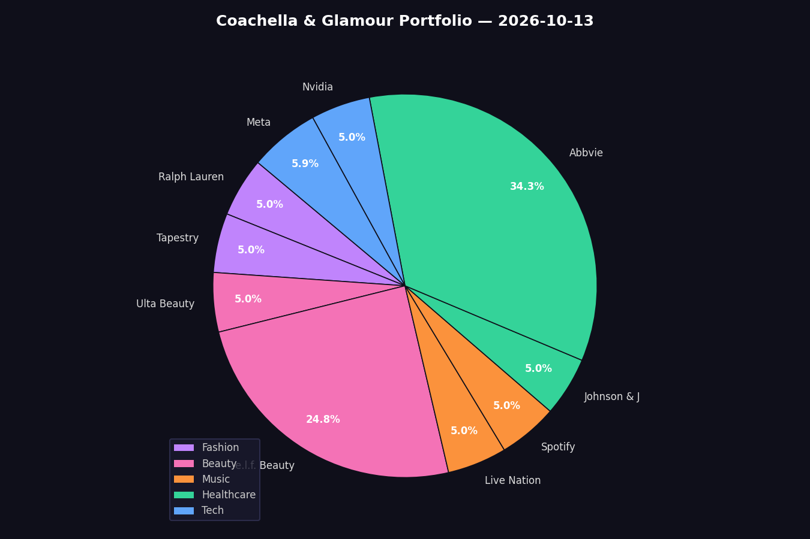
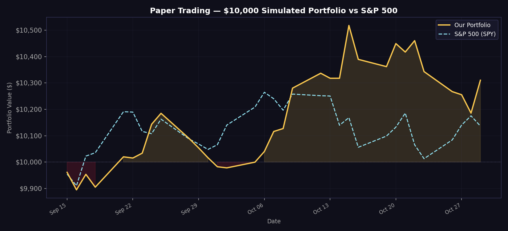
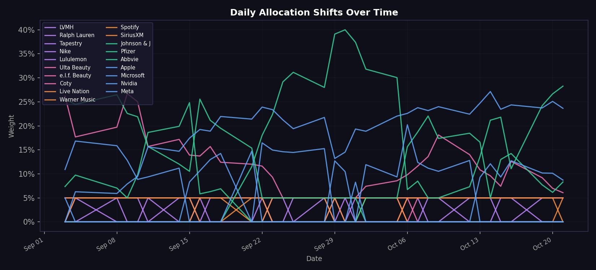

# 🎶 Coachella & Glamour Portfolio — 2026-10-19

> **Strategy:** MPT with binary linking constraints, 60-day sliding window
> **Mode:** 🚀 MAX SHARPE
> **Stocks selected:** 9 / 25 &nbsp;|&nbsp; **Sectors:** 5

---

## 📊 Optimal Allocation (Linking Constraints: 5% ≤ X ≤ 40%)

| Stock | Ticker | Sector | Weight | Binary Y |
|-------|--------|--------|--------|----------|
| Abbvie | `ABBV` | Healthcare | **30.55%** | ✅ 1 |
| e.l.f. Beauty | `ELF` | Beauty | **25.90%** | ✅ 1 |
| Microsoft | `MSFT` | Tech | **8.55%** | ✅ 1 |
| Ralph Lauren | `RL` | Fashion | **5.00%** | ✅ 1 |
| Nike | `NKE` | Fashion | **5.00%** | ✅ 1 |
| Ulta Beauty | `ULTA` | Beauty | **5.00%** | ✅ 1 |
| SiriusXM | `SIRI` | Music | **5.00%** | ✅ 1 |
| Pfizer | `PFE` | Healthcare | **5.00%** | ✅ 1 |
| Meta | `META` | Tech | **5.00%** | ✅ 1 |

**Stocks excluded (Y=0, X=0):**
`LVMUY`, `TPR`, `LULU`, `EL`, `COTY`, `IPAR`, `LYV`, `WMG`, `SPOT`, `IHRT`, `UNH`, `JNJ`, `LLY`, `AAPL`, `NVDA`, `GOOGL`

---

## 📈 Portfolio Performance

| Metric | Our Portfolio | S&P 500 (SPY) |
|--------|--------------|---------------|
| Annualised Return | **97.26%** | 10.68% |
| Annualised Risk   | 19.13% | 12.11% |
| Sharpe Ratio      | **4.822** | 0.469 |
| Max Drawdown      | — | -3.38% |

---

## 💰 Paper Trading (Simulated $10,000)

| Portfolio Value | SPY Value |
|----------------|-----------|
| **$10,057.85** | $10,044.18 |

Return vs Buy-and-Hold SPY: **0.58%** vs 0.44%

---

## 🌡️ Fear Index & Market Signals

**VIX Level:** 20.0 ✅ Normal — max-Sharpe mode active

**Golden Cross Signals (10d MA vs 30d MA):**

| Ticker | Signal |
|--------|--------|
| `LVMUY` | 🔴 Bearish |
| `RL` | 🟢 Bullish |
| `TPR` | 🟢 Bullish |
| `NKE` | ⚪ Neutral |
| `LULU` | 🔴 Bearish |
| `EL` | 🟢 Bullish |
| `ULTA` | 🟢 Bullish |
| `ELF` | 🟢 Bullish |
| `COTY` | 🟢 Bullish |
| `IPAR` | ⚪ Neutral |
| `LYV` | 🟢 Bullish |
| `WMG` | 🟢 Bullish |
| `SPOT` | 🟢 Bullish |
| `IHRT` | 🔴 Bearish |
| `SIRI` | ⚪ Neutral |
| `UNH` | 🟢 Bullish |
| `JNJ` | ⚪ Neutral |
| `LLY` | 🟢 Bullish |
| `PFE` | 🟢 Bullish |
| `ABBV` | 🟢 Bullish |
| `AAPL` | 🟢 Bullish |
| `MSFT` | 🟢 Bullish |
| `NVDA` | 🟢 Bullish |
| `META` | 🟢 Bullish |
| `GOOGL` | 🟢 Bullish |

---

## 📉 Charts

---
*Auto-generated by GitHub Actions · 2026-10-19 · OPIM 5641*