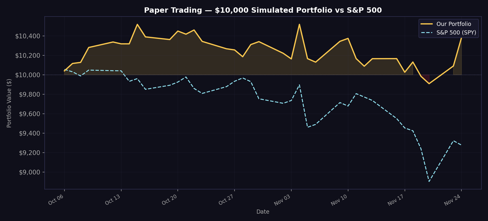

# 🎶 Coachella & Glamour Portfolio — 2026-11-17

> **Strategy:** MPT with binary linking constraints, 60-day sliding window
> **Mode:** 🚀 MAX SHARPE
> **Stocks selected:** 10 / 25 &nbsp;|&nbsp; **Sectors:** 5

---

## 📊 Optimal Allocation (Linking Constraints: 5% ≤ X ≤ 40%)

| Stock | Ticker | Sector | Weight | Binary Y |
|-------|--------|--------|--------|----------|
| Pfizer | `PFE` | Healthcare | **25.06%** | ✅ 1 |
| Microsoft | `MSFT` | Tech | **17.64%** | ✅ 1 |
| Coty | `COTY` | Beauty | **17.60%** | ✅ 1 |
| e.l.f. Beauty | `ELF` | Beauty | **9.69%** | ✅ 1 |
| Ralph Lauren | `RL` | Fashion | **5.00%** | ✅ 1 |
| Tapestry | `TPR` | Fashion | **5.00%** | ✅ 1 |
| Warner Music | `WMG` | Music | **5.00%** | ✅ 1 |
| Spotify | `SPOT` | Music | **5.00%** | ✅ 1 |
| Abbvie | `ABBV` | Healthcare | **5.00%** | ✅ 1 |
| Apple | `AAPL` | Tech | **5.00%** | ✅ 1 |

**Stocks excluded (Y=0, X=0):**
`LVMUY`, `NKE`, `LULU`, `EL`, `ULTA`, `IPAR`, `LYV`, `IHRT`, `SIRI`, `UNH`, `JNJ`, `LLY`, `NVDA`, `META`, `GOOGL`

---

## 📈 Portfolio Performance

| Metric | Our Portfolio | S&P 500 (SPY) |
|--------|--------------|---------------|
| Annualised Return | **85.42%** | -3.32% |
| Annualised Risk   | 20.41% | 14.19% |
| Sharpe Ratio      | **3.941** | -0.586 |
| Max Drawdown      | — | -5.92% |

---

## 💰 Paper Trading (Simulated $10,000)

| Portfolio Value | SPY Value |
|----------------|-----------|
| **$10,075.98** | $9,664.84 |

Return vs Buy-and-Hold SPY: **0.76%** vs -3.35%

---

## 🌡️ Fear Index & Market Signals

**VIX Level:** 22.9 ✅ Normal — max-Sharpe mode active

**Golden Cross Signals (10d MA vs 30d MA):**

| Ticker | Signal |
|--------|--------|
| `LVMUY` | 🟢 Bullish |
| `RL` | 🟢 Bullish |
| `TPR` | 🟢 Bullish |
| `NKE` | 🟢 Bullish |
| `LULU` | 🟢 Bullish |
| `EL` | 🟢 Bullish |
| `ULTA` | 🟢 Bullish |
| `ELF` | 🟢 Bullish |
| `COTY` | 🟢 Bullish |
| `IPAR` | 🟢 Bullish |
| `LYV` | 🟢 Bullish |
| `WMG` | 🟢 Bullish |
| `SPOT` | 🟢 Bullish |
| `IHRT` | 🔴 Bearish |
| `SIRI` | 🟢 Bullish |
| `UNH` | 🟢 Bullish |
| `JNJ` | 🟢 Bullish |
| `LLY` | 🟢 Bullish |
| `PFE` | 🟢 Bullish |
| `ABBV` | 🟢 Bullish |
| `AAPL` | 🟢 Bullish |
| `MSFT` | 🟢 Bullish |
| `NVDA` | 🔴 Bearish |
| `META` | 🔴 Bearish |
| `GOOGL` | 🔴 Bearish |

---

## 📉 Charts

---
*Auto-generated by GitHub Actions · 2026-11-17 · OPIM 5641*